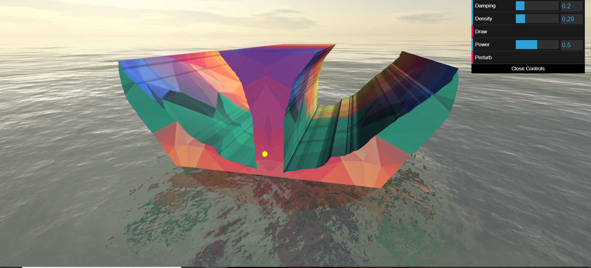

# [rock-the-boat](https://andrewdworschak.github.io/rock-the-boat)
Our final project for Physics 350, Applications of Classical Mechanics at the University of British Columbia.
**rock-the-boat is a simulation engine that uses Lagrangian mechanics to simulate the stability of a floating hull.**
### Screenshot

### Functionality
- **Damping**: Control the amount of friction force the boat experiences.
- **Density**: Control the density of the boat relative to the water.
- **Draw**: Draw a new boat hull.
- **Power**: Control the strength of a perturbation.
- **Perturb**: Nudge the boat with a specified power.

**[Visit our website](https://andrewdworschak.github.io/rock-the-boat) now to use the tool.**
Created by Andrew Dworschak, Rahat Dhande, Justin Kang, Jacob Budzis & Alex Swift-Scott.